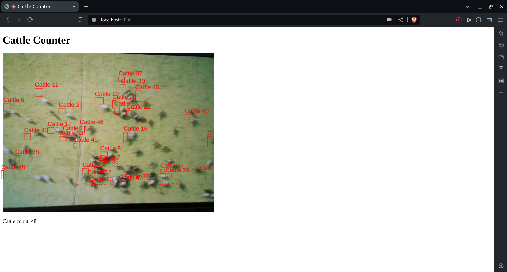

### Model Wrapper

Wrap the Cattle count model.

Count the no of cattle on device camera video stream

example: 

### To run locally

> Normal Install

1. Install python

2. Add virtual env (optional)

3. `pip install -r requirements.txt`

4. `python app.py`

5. Open [http://localhost:5000/](http://localhost:5000/)

> With Docker

1a. On linux `docker compose up`

1b. On Windows `docker-compose up`

2. Open [http://localhost:5000/](http://localhost:5000/)